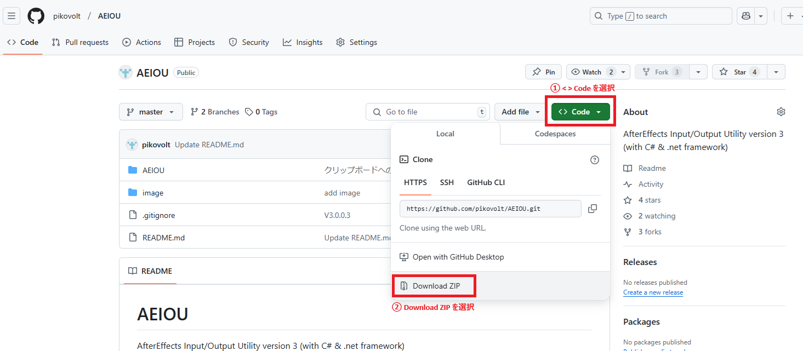
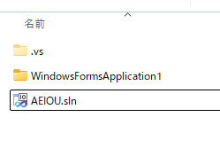
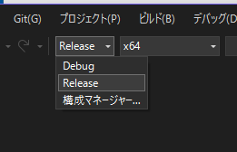
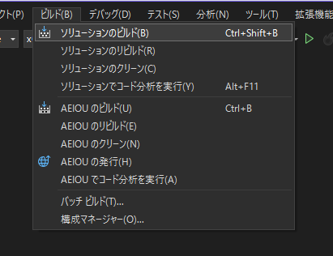
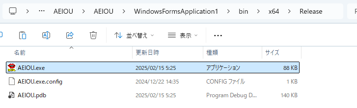
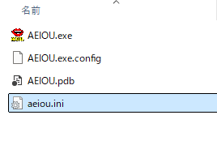
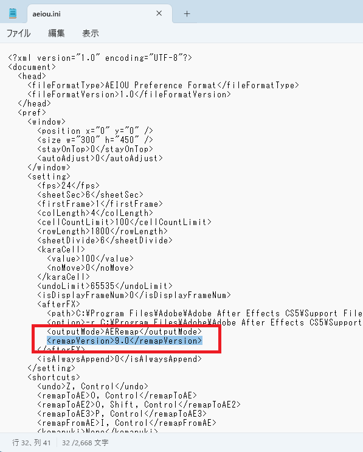

# AEIOU  
AfterEffects Input/Output Utility version 3 (with C# &amp; .net framework)  
  
  
アニメ撮影者向けのコマ打ちツール（タイムシート様式）です。  
  
PCの64bitOS化が進んだこともあり .net frameworkベースで64bit対応を行いました。  
その都合でコンパイラをVisualStudioに変更、コードを１からＣ＃で書き直しています。  
１から書き直しのついでにアンドゥ機能を追加。（リドゥはありません..）  
メモリ制限も考える必要性がなくなったので、特に編集範囲に秒数制限はありません。  
  
稚拙なコードではありますが、ツール開発は以下のようなポリシーで行われております。 （※運用・免責の項目を参照） 

  
# 注意

　最近 After Effectsのタイミング情報のフォーマットが新しくなり、混乱が起きているので以下に記述を追加します。

　・当ツールは、初期ビルドのみツリーの奥の方に置いていますが、最新版はビルドの必要があります。  
　・EXEファイルの配布だとウィルスなどの問題があるため、ご自分でのビルドをお願いします。  
　・ビルドに必要なファイルの取得方法がわからない方は、以下の場所からZIPファイルをダウンロードして、ドキュメントフォルダなどに展開してください。
　　  
　・'Visual Studio Community' という無償提供の開発ツールをインストール後、.slnファイルを開くことでツールのプロジェクトファイルが読み込まれますので、Release版のビルドを行ってください。  
　　  
　　  
　　  
　・ビルドで、bin/x64/Releaseの階層が作成されて、その中に .exeファイルが生成されます。  
　　  

　・タイミング情報のバージョン数値は、AEIOU.exeを一度終了した後に作成される.iniファイルをメモ帳で開き「remapVersion」タグで囲われた数値を書き換えることで指定のバージョン数値に変更できます。  
　　※開く際は「メモ帳」を使う必要があります。ワードパッドは、使用不可です。（テキストエディタでも可。文字コードは、UTF-8で保存してください）  
　　  
　　  

　また、現在では ver3より前のバージョンのサポートができません。  
　当時使用していたコンパイラが有償で数万円を支出する余裕もなかったため、Visual Studioの環境に移行し、当時の古いコードも手元にありません。  
　ver3への移行を行う、もしくは別ツールへの移行の検討をお願いします。（ただ、別ツールの開発者さんにあまり無理な要望出しはできるだけお控えください。ご迷惑になりかねません、ご理解いただければ幸いです。）  

　現在では Visual Studioは個人利用の範囲では無償利用可能となっているので、ご自分の利用する範囲でビルドした実行ファイルを利用することに制限はない状況です。（※オープンソースのプログラムを、個人が自分用にビルドして使う。そのこと自体は、そもそも商用目的に当て嵌まらないであろう。という解釈です。多人数で利用するという場合は、Visual Studio Communityの商用利用の規約をよく確認してください。）  
　お手数とは存じますが、よろしくお願いいたします。  

# 当ツールの運用規約・免責等について  
  
　・当ツール制作者（以下甲と称す）と  
　　当ツールのご利用者（以下乙と称す）は、  
　　当ツール（以下丙と称す）の利用について、  
　　ここに定める運用規約に同意するものとします。  
  
　・丙はAdobe AfterEffectsによるアニメーション撮影作業（シート打ち込み）手順軽減目的のソフトです。  
　　丙の制作・配布は営利目的ではありません。ただ乙の作業ストレスを解消することが目的です。  
　　個人法人を問わずいかなる場合も丙は無償提供されるものとします。  
　　丙の利用に関して金銭の取引を行わないでください。  
　　丙自体を付加価値とした取引を行わないでください。  
　・丙の利用により乙の作業ストレスが解消できない場合、可能な限り利用を停止し別途解消方法を検討してください。  
　・丙のご利用は乙の責任において行ってください。  
　　甲は丙の利用により生じる乙の損害に対する責任を負いません。  
　　※バグによる作業データ消失の可能性があります。  
　　※ウィルスチェックは行っていますが、100%ウィルス感染がないことを保証出来ません。  
　　　実行前に必ずご自身でウィルスチェックを行って下さい。  
　　※環境移行で使えなくなる可能性があります。  
　　※事前の動作確認・代替物調査など確認の上で計画的にご利用下さい。  
　・丙の著作権は甲に帰属するものとします。  
　・乙は上記について承諾の上で丙の利用を許可されるものとします。  
　・上記について承諾の上での丙の配布はご自由に願います。  
　　※配布の際は、配布先に対しても上記について承諾の確認をお願いします。  
  
# バグ・要望について  
　・バグ・要望については可能な限りステップバイステップでの手順説明、使用ＯＳなど実行環境についてレポート願います。  
　　レポート戴けない場合・当方で問題再現不可能な場合には対応できない場合も御座いますのでご理解ご協力をお願いします。  
　・バグ・要望には当方の可能な範囲で応えます。  
　　※必ず応えるとのお約束は出来ません。  
　　※環境がなく再現や動作確認不能な場合などで対応出来ない場合もあります。  
　・ご要望の機能追加について後々著作権を主張されても応じられません。  
　　主張される方は要望を出さないで下さい。  
　・上記についてご承諾戴いた上でご連絡下さい。  
  
# ご要望の受付可能な範囲について  
　・連絡先を特に明記しておりません。  
　・対応は、まずは間接的にでも当方にコンタクトできる方のみに限定させていただこうと考えております。  
　・それなりに責任を持って対応するには限度がある為です。ご理解の程よろしくお願い致します。  
